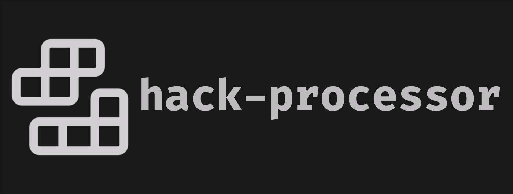

 

# Hack Processor: A systemVerilog implementation of the hack processor from the Nand to Tetris course 

## Table of Contents 

- Project Description
- Processor Architecture
- Simulator
- Usage 
- Acknowledgements
- 
## Project Description 

 This project is a System Verilog implementation of the Hack-Processor, a 16-bit computer processor introduced in the NAND to Tetris course. The NAND to Tetris course, also known as "From Nand to Tetris: Building a Modern Computer from First Principles," is an educational program offered by the Hebrew University of Jerusalem. More can be found on their [official site](https://www.nand2tetris.org/). 

## Processor Architecture  

The Hack-Processor features a Harvard architectural design with separated instruction and data memory, allowing for simultaneous instruction fetch and data access. Much of the processor’s architecture has been simplified for educational purposes, as such there is no pipelining and an absence of hardware implementation for multiplication and division. Furthermore, the goal of this project was to create an as accurate implementation as possible of the Hack CPU, thus we were uninterested in computational optimizations. 

## Simulator  

To simulate the behavior and functionality of the Hack Processor, we use the [Verilator](https://www.veripool.org/verilator/) simulator. Verilator is an open-source Verilog simulator that converts synthesizable Verilog code into C++ models. There is no inherent limitation to the using other simulators such as [Icarus](https://github.com/steveicarus/iverilog] or [ModelSim](https://eda.sw.siemens.com/en-US/ic/modelsim/), however you would need to convert the testbench models as they are written in C++.  

To find the scripting examples for running the Verilator simulator you use the testbench scripts created found in [/src/scripts/] (https://github.com/CgKaminski/hack-processor/tree/main/src/scripts).  

## Usage 

Processor architecture and course are all used from the aforementioned Nand to Tetris course. 

## Acknowledgements 

We would like thank Shimon Schocken and Noam Nisan for their efforts in creating the Nand to Tetris! 
